# Custom 3D printable case for the [Foenix F256 Jr](https://c256foenix.com/f256-jr/?v=796834e7a283) retro computer. 
This repository contains all the 3D files to print a custom case for the Foenix F256 JR retro computer.

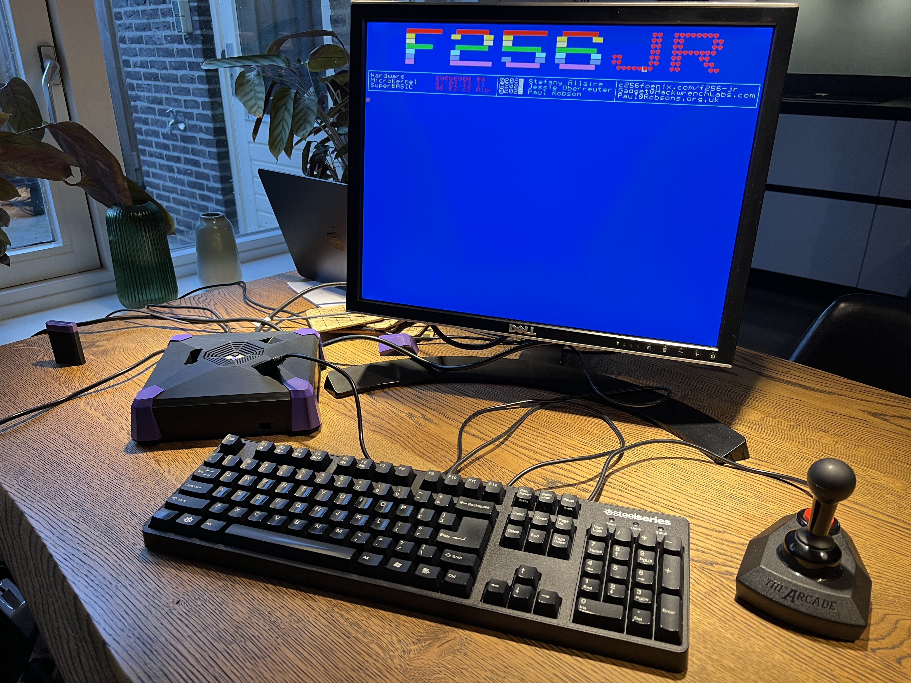
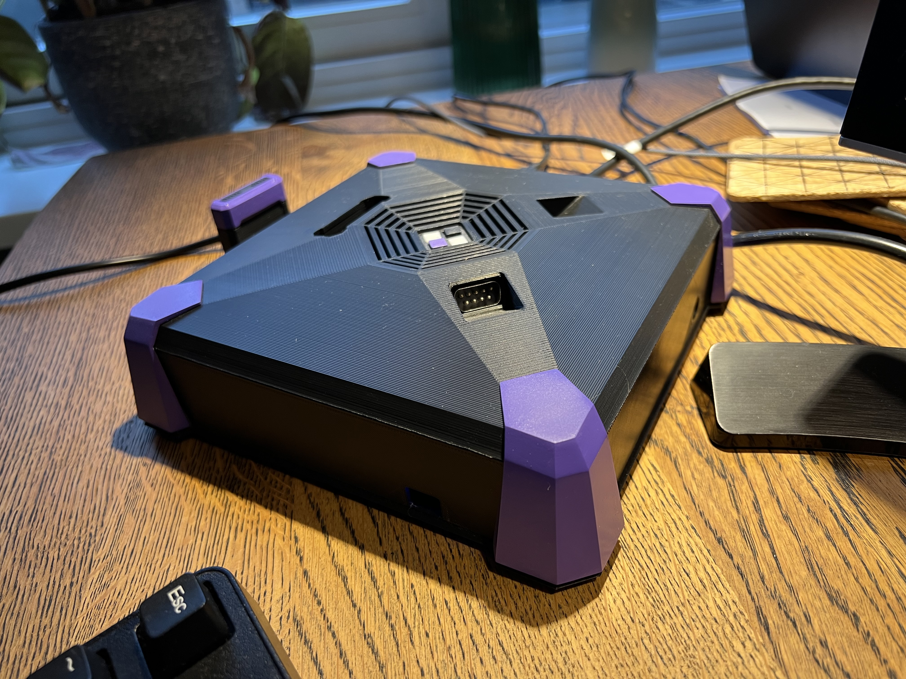
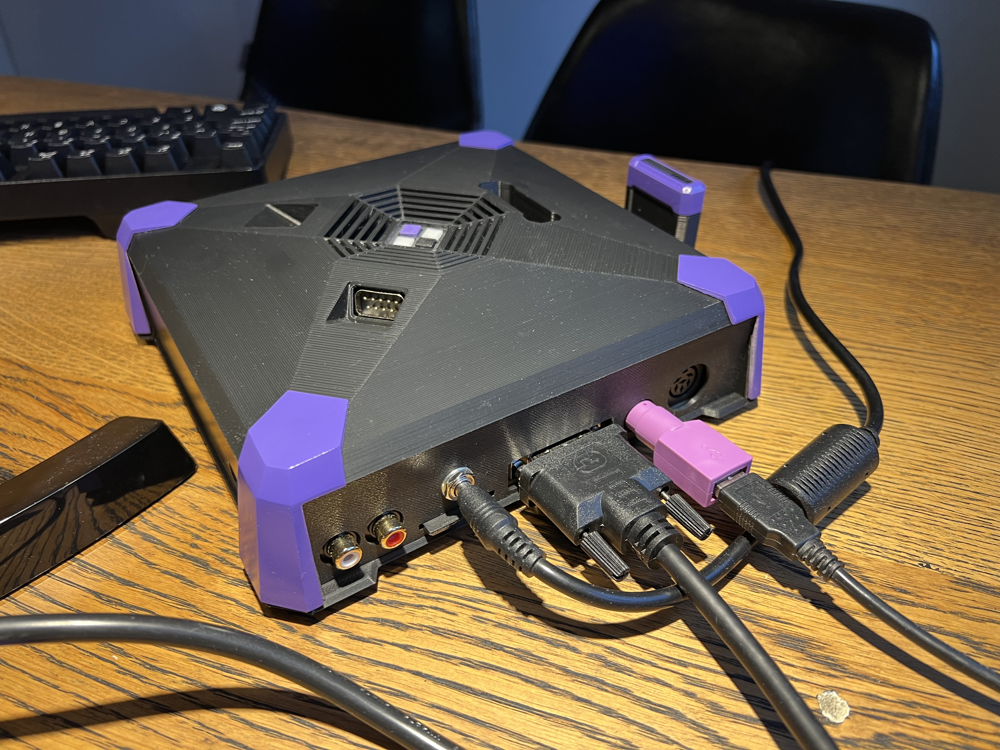

The following components are perfect for use in the case:
* PSU: https://www.amazon.nl/gp/product/B0045IXKTQ/ref=ppx_yo_dt_b_asin_title_o05_s00?ie=UTF8&psc=1
* Joystick ports: https://www.amazon.nl/dp/B0067DB6RU/ref=pe_28126711_487102941_TE_SCE_dp_1
* Power/Reset/Leds: https://www.amazon.nl/dp/B09N1GTJJP/ref=pe_28126711_487102941_TE_SCE_dp_1

## Sister case for SBC based development machine (RPI4 in my case)

This case is meant to be stacked below the F256Jr case combining into a physical development stack. They connect through a very short USB cable.

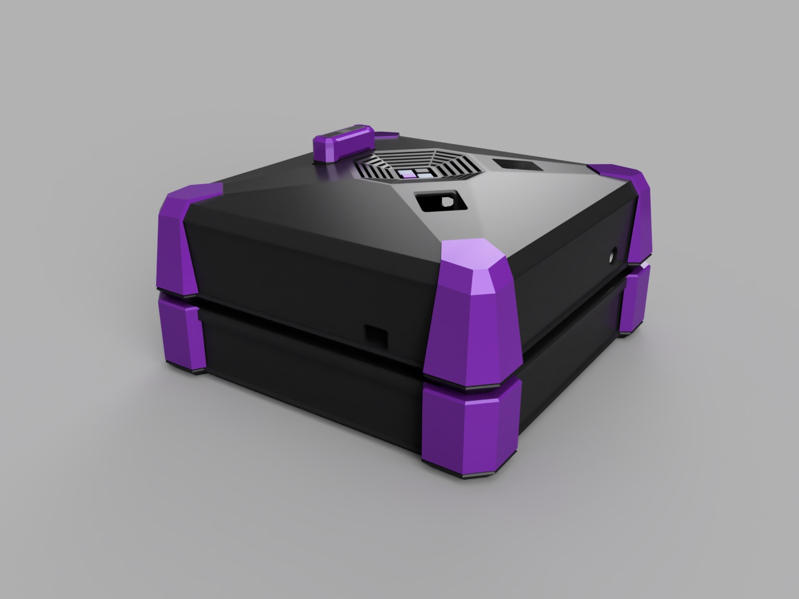
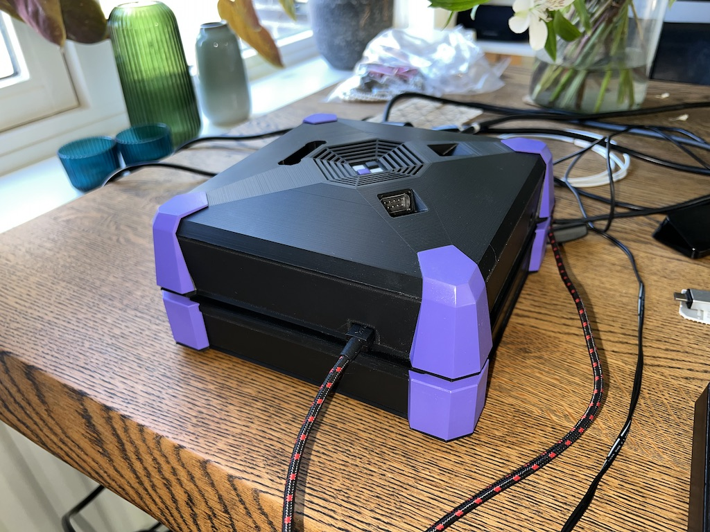
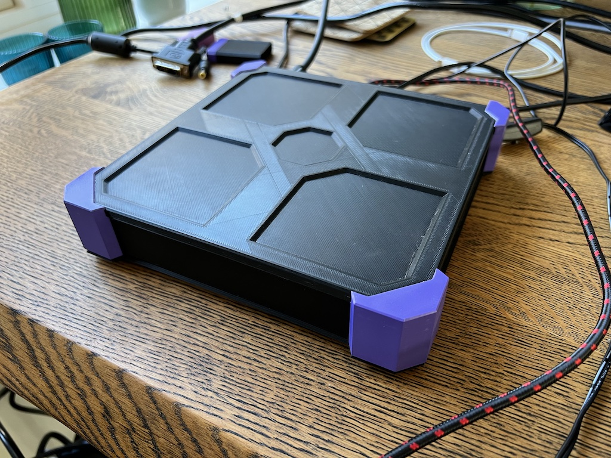
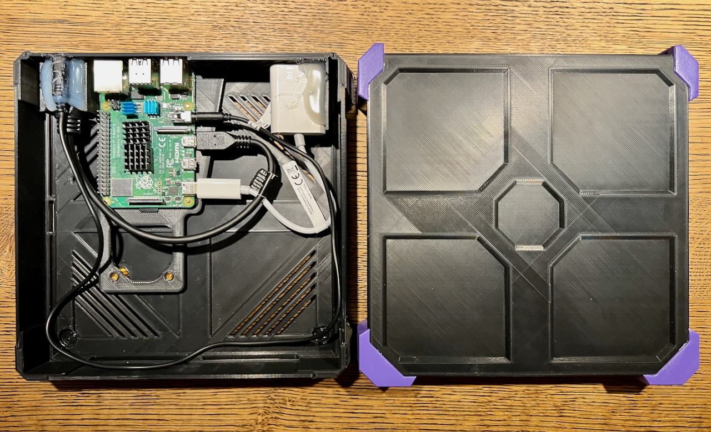
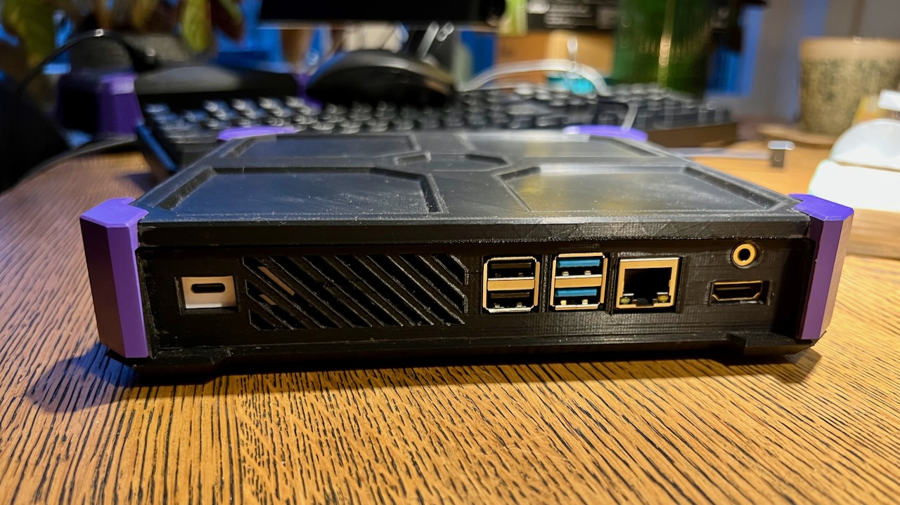

## Custom Dell 1707Fp

Here are a bunch of pictures showing a custom paint job on a Dell 1707Fp monitor to fit the color scheme of the case.

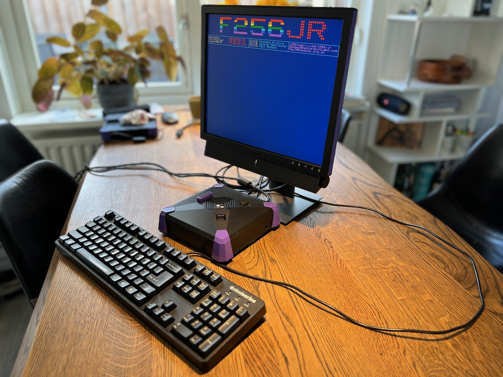
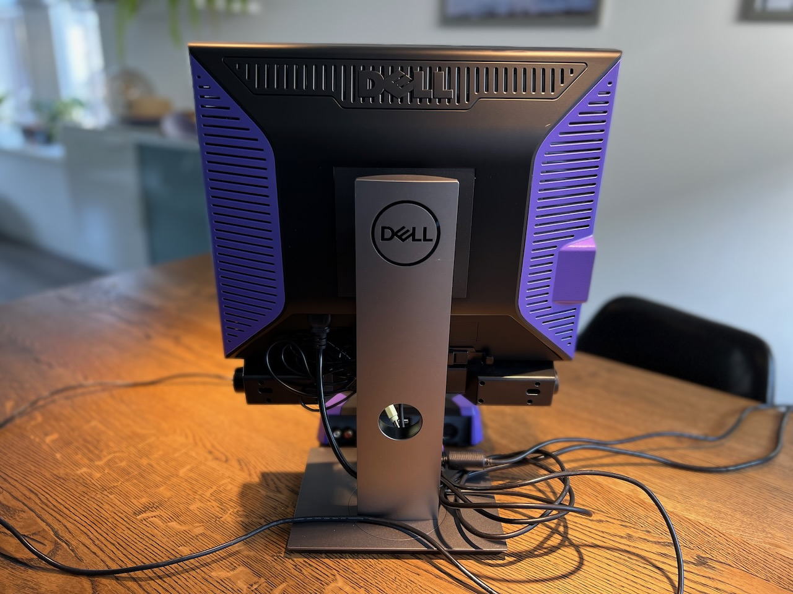
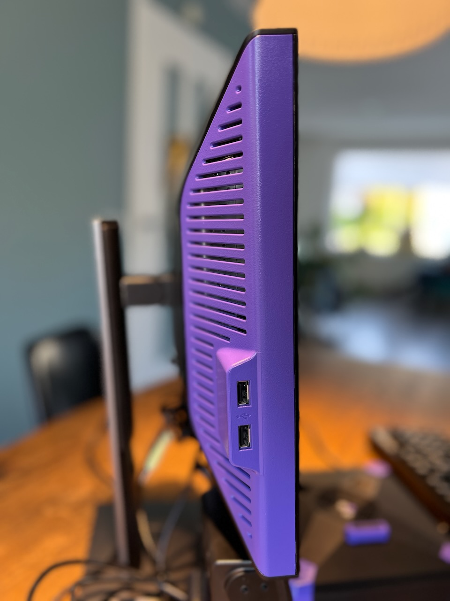
